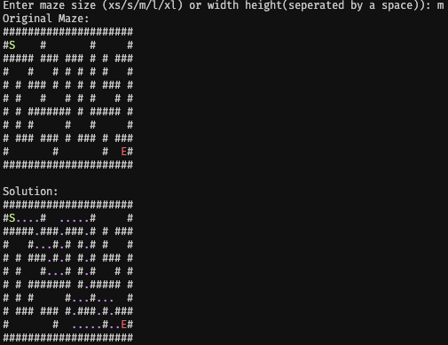

# Maze Solver

## 📌 Project Overview
This Python-based project generates and solves mazes using **Recursive Backtracking** (RB) for maze generation and **Breadth-First Search (BFS)** for maze solving. The maze solver visualizes the shortest path through the maze.

### Key Features
1. **Maze Generation**: Creates a maze using RB.  
2. **Pathfinding**: Finds the shortest path using BFS.  
3. **Interactive Size Selection**: Choose pre-defined maze sizes (`xs`, `s`, `m`, `l`, `xl`) or specify custom dimensions.
4. **Visualization**: Displays the maze and highlights the solution path.  

#### Maze Sizes and Difficulty Levels
| **Size** | **Width** | **Height** | **Description**                            |  
|----------|-----------|------------|--------------------------------------------|  
| XS       | 9         | 9          | Tiny maze, easy to solve                   |  
| S        | 11        | 11         | Small maze, simple to solve                |  
| M        | 21        | 11         | Medium maze, moderate challenge            |  
| L        | 31        | 21         | Large maze, challenging to solve           |  
| XL       | 41        | 31         | Extra-large maze, very challenging to solve |  

<br />

## ⚙️ Installation
### Prerequisites
- Python (latest release recommended)

### Steps
1. Clone or download the repository.
2. Ensure all files (`main.py`, `MazeCreation.py`, `BSF.py`, `RB.py`) are in the same directory.
3. Run the program using:

   ```bash
   python main.py
   ```

<br />

## 🚀 Usage
1. Run the script and input the desired maze size:
   - **Pre-defined sizes**: `xs`, `s`, `m`, `l`, `xl`.
   - **Custom dimensions**: Provide `width` and `height` separated by a space (e.g., `21 11`).

2. The program will:
   - Generate the maze.
   - Display the maze.
   - Find and display the shortest path (if possible).

### Example Interaction (note: vertical spacing in .md is hyperbolic)


<br />

## 📂 File Descriptions
### `main.py`
Handles user input, initializes the maze, and orchestrates the solving and visualization process.

### `MazeCreation.py`
Defines the `MazeCreation` class:
- Constructs the maze grid.
- Uses recursive backtracking to carve out paths.
- Presets the start (`S`) and end (`E`) points.

### `RB.py`
Implements Recursive Backtracking:
- Defines the `Cell` class representing maze components.
- Recursive algorithm clears walls to create a maze.

### `BSF.py`
Implements Breadth-First Search:
- Finds the shortest path from start to end.
- Includes a function to visualize the path.

<br />

## 🧠 Algorithm Details
### Maze Generation
- **Recursive Backtracking**:
  - Starts from a random cell.
  - Visits neighbors by clearing walls in between.
  - Backtracks when no unvisited neighbors remain.
  - [RB Wiki](https://en.wikipedia.org/wiki/Maze_generation_algorithm#Randomized_depth-first_search)

### Maze Solving
- **Breadth-First Search**:
  - Explores all possible paths layer by layer.
  - Guarantees finding the shortest path in the maze.
  - [BFS Wiki](https://en.wikipedia.org/wiki/Breadth-first_search)

<br />

## ✨ Customization
- **Maze Sizes**: Modify or add preset sizes in the `main.py` file.
- **Maze Appearance**: Adjust cell rendering in the `MazeCreation` and `visualize_path` functions.
- **ANSI Escape Codes**: Adjust colors of all objects within the program (e.g. walls, path, start).
